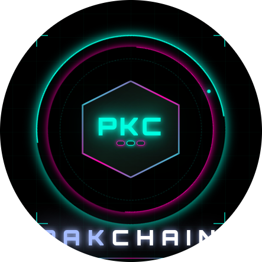

# 🇵🇰 PakChain

<div align="center">



**Pakistan's First Community-Built Blockchain**

[](https://opensource.org/licenses/MIT)
[]()
[]()
[]()

*"First blockchain built in Pakistan — 08 June 2026"*

</div>

---

## 🌐 What is PakChain?

PakChain is an open-source, decentralized blockchain network built and maintained by Pakistani developers. It introduces **PakCrypto (PKC)** — a peer-to-peer digital currency with a fixed supply of 10 million coins, built on the proven Bitcoin Core codebase.

PakChain is not built for profit or speculation. It is built to learn, to experiment, and to prove that Pakistani developers can build world-class blockchain infrastructure from scratch.

---

## 💎 PakCrypto (PKC) — Coin Specs

| Parameter | Value |
|---|---|
| Coin Name | PakCrypto |
| Ticker | PKC |
| Total Supply | 10,000,000 PKC |
| Block Reward | 10 PKC |
| Block Time | 5 Minutes |
| Halving Interval | 500,000 Blocks |
| Algorithm | SHA-256 Proof of Work |
| Default Port | 8999 |
| Address Prefix | pak1... (bech32) |
| Magic Bytes | 0x50 0x41 0x4B 0x43 |
| Genesis Date | 08 June 2026 |
| Genesis Message | "PakChain 08/Jun/2026 First blockchain built in Pakistan" |

---

## 🚀 Build from Source

### Requirements (Ubuntu/Debian/Zorin OS)

```bash
sudo apt install -y \
  build-essential cmake \
  libboost-all-dev \
  libevent-dev \
  libssl-dev \
  qt6-base-dev \
  qt6-tools-dev \
  qt6-tools-dev-tools \
  libqrencode-dev \
  libxkbcommon-dev
```

### Build

```bash
git clone https://github.com/opffhere99/pakchain.git
cd pakchain
cmake -B build -DBUILD_GUI=ON
cmake --build build -j2
```

### Run Wallet (GUI)

```bash
# Regtest mode (for testing)
./build/bin/bitcoin-gui -regtest

# Or use shortcut (if installed)
pakchain -regtest
```

### Run Node (Daemon)

```bash
./build/bin/bitcoind -daemon
```

### Shortcut Setup

```bash
sudo nano /usr/local/bin/pakchain
# Add: ~/path/to/pakchain/build/bin/bitcoin-gui "$@"
sudo chmod +x /usr/local/bin/pakchain
```

---

## ⛏️ Mining PKC (Regtest)

```bash
# Start wallet
pakchain -regtest

# In another terminal — mine 101 blocks
./build/bin/bitcoin-cli -regtest \
  -rpcuser=pakchain \
  -rpcpassword=pakchain123 \
  -rpcwallet="PakWallet" \
  -generate 101

# Check balance
./build/bin/bitcoin-cli -regtest \
  -rpcuser=pakchain \
  -rpcpassword=pakchain123 \
  -rpcwallet="PakWallet" \
  getbalance
```

---

## 📁 Project Structure

```
pakchain/
├── src/
│   ├── kernel/
│   │   └── chainparams.cpp    ← PakChain parameters
│   ├── qt/
│   │   ├── res/
│   │   │   ├── icons/         ← PakChain logo
│   │   │   └── pakchain.qss   ← Cyberpunk dark theme
│   │   └── forms/             ← Wallet UI forms
│   └── consensus/             ← Consensus rules
├── build/                     ← Compiled binaries
└── README.md
```

---

## 🗺️ Roadmap

- [x] **Phase 1** — Fork Bitcoin Core, customize chain parameters
- [x] **Phase 2** — Build cyberpunk wallet GUI with PKC branding
- [x] **Phase 3** — Mine genesis block, test regtest network
- [ ] **Phase 4** — Launch mainnet with seed nodes
- [ ] **Phase 5** — Windows & Android wallet
- [ ] **Phase 6** — Block explorer
- [ ] **Phase 7** — PKC ↔ USDT exchange
- [ ] **Phase 8** — Telegram tap-to-mine app

---

## 🔐 Tokenomics

| Epoch | Blocks | Reward | PKC Mined |
|---|---|---|---|
| 1 | 0 — 500,000 | 10 PKC | 5,000,000 |
| 2 | 500,001 — 1,000,000 | 5 PKC | 2,500,000 |
| 3 | 1,000,001 — 1,500,000 | 2.5 PKC | 1,250,000 |
| 4 | 1,500,001 — 2,000,000 | 1.25 PKC | 625,000 |
| ∞ | ... | → 0 | ~10,000,000 total |

> No pre-mine. No ICO. No developer tax. 100% fairly mined.

---

## 🛠️ RPC Config (~/.bitcoin/bitcoin.conf)

```ini
[regtest]
server=1
rpcuser=pakchain
rpcpassword=pakchain123
rpcport=18443
```

---

## 📄 License

PakChain is released under the MIT License. See [COPYING](COPYING) for details.

Based on [Bitcoin Core](https://github.com/bitcoin/bitcoin) — © 2009-2026 The Bitcoin Core developers.

---

## 🇵🇰 About

> PakChain is proof that Pakistani developers can build real blockchain infrastructure.  
> Every block mined is a small act of technological sovereignty.  
> Pakistan is here. Pakistan is building. Pakistan is not waiting for permission.

**Genesis Block:** 08 June 2026  
**Built with ❤️ in Pakistan**
